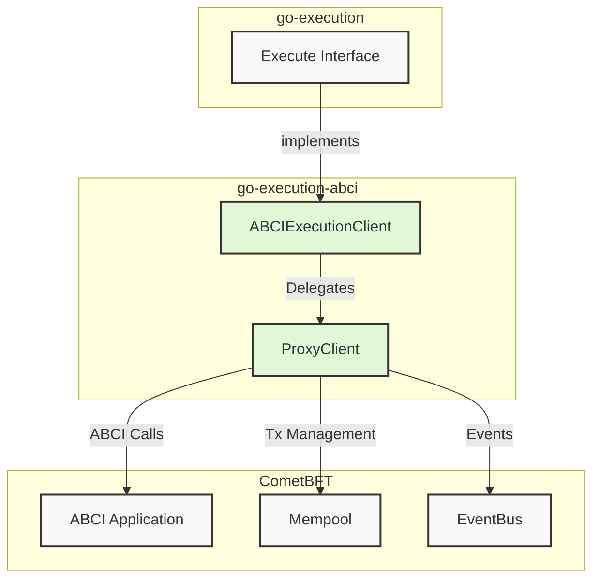

## Architecture

```mermaid
graph TB
  subgraph go-execution
    R[Execute Interface]
  end
  subgraph "go-execution-abci"
    AEC[ABCIExecutionClient]
    PC[ProxyClient]
  end
  subgraph "CometBFT"
    ABCI[ABCI Application]
    MP[Mempool]
    EB[EventBus]
  end
  R -->|implements| AEC
  AEC -->|Delegates| PC
  PC -->|ABCI Calls| ABCI
  PC -->|Tx Management| MP
  PC -->|Events| EB
  classDef default fill:#f9f9f9,stroke:#333,stroke-width:2px;
  classDef highlight fill:#e1f7d5,stroke:#333,stroke-width:2px;
  class AEC,PC highlight;
```
