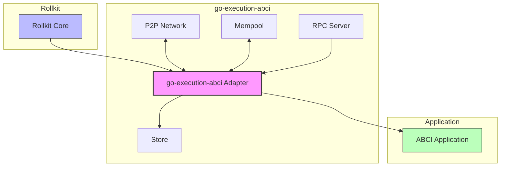
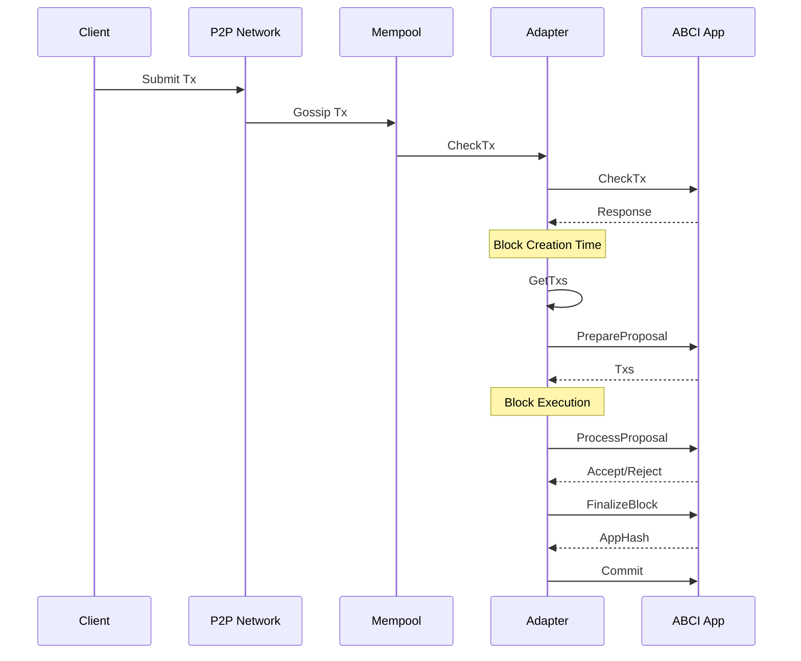
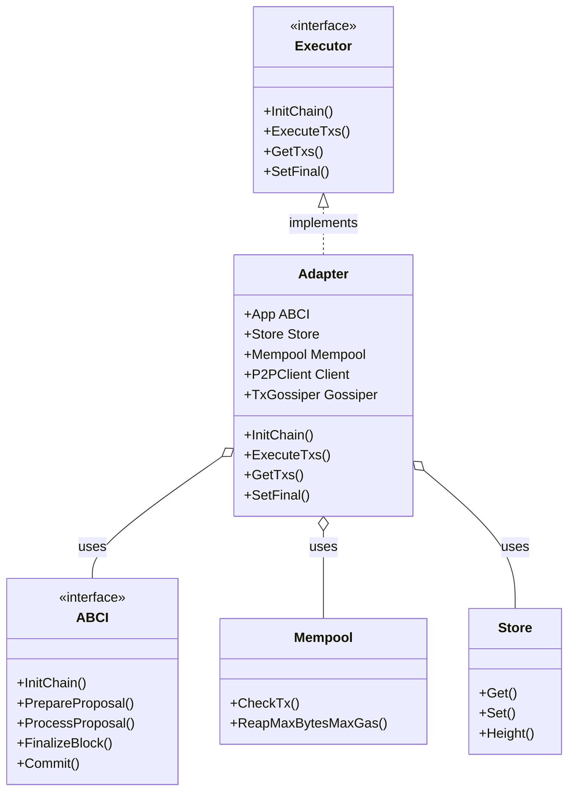

# go-execution-abci

An ABCI adapter for [Rollkit](https://github.com/rollkit/rollkit) that enables ABCI-compatible applications to be used with Rollkit's execution layer.

## Overview

`go-execution-abci` is a bridge between ABCI-compatible applications and Rollkit's execution layer. It implements the Rollkit execution interface and adapts it to the ABCI interface, allowing developers to use existing ABCI applications with Rollkit.

This adapter connects various components of the Rollkit ecosystem:

- Provides compatibility with the Cosmos SDK and CometBFT ABCI applications
- Implements transaction handling, state management, and blockchain operations
- Supports P2P communication for transaction gossip

## Architecture Overview



## Features

- **ABCI Compatibility**: Run any ABCI-compatible application with Rollkit.
- **Transaction Management**: Handles transaction receipt, validation, and execution.
- **State Management**: Manages blockchain state including validators and consensus parameters.
- **P2P Communication**: Implements transaction gossip across the network.
- **RPC Endpoints**: Provides compatible API endpoints for clients to interact with.

## ABCI Compatibility

This adapter achieves compatibility with ABCI by calling the appropriate methods on the ABCI application during the execution lifecycle. It implements the necessary interfaces to ensure that transactions are processed correctly, blocks are finalized, and state is committed.

Note, that because of the nature of Rollkit (single proposer), **Vote Extensions are not supported**. The adapter will not call the `VoteExtensions` methods on the ABCI application, and any logic related to vote extensions should be handled separately or not used at all.

## Installation

```bash
go get github.com/rollkit/go-execution-abci
```

## Dependencies

The project relies on several key dependencies:

- [Rollkit](https://github.com/rollkit/rollkit): For the core rollup functionality
- [Cosmos SDK](https://github.com/cosmos/cosmos-sdk): For the ABCI integration
- [CometBFT](https://github.com/cometbft/cometbft): For consensus-related types and functionality
- [libp2p](https://github.com/libp2p/go-libp2p): For peer-to-peer networking

## Usage

The adapter can be used to create a Rollkit node with an ABCI application, such as a Cosmos SDK chain.

```diff
diff --git a/cmd/gmd/cmd/commands.go b/cmd/gmd/cmd/commands.go
index 310b195..19abe36 100644
--- a/cmd/gmd/cmd/commands.go
+++ b/cmd/gmd/cmd/commands.go
@@ -2,6 +2,7 @@ package cmd
 
 import (
 	"errors"
+	"gm/app"
 	"io"
 
 	"github.com/spf13/cobra"
@@ -24,7 +25,8 @@ import (
 	banktypes "github.com/cosmos/cosmos-sdk/x/bank/types"
 	genutilcli "github.com/cosmos/cosmos-sdk/x/genutil/client/cli"
 
-	"gm/app"
+	abciserver "github.com/rollkit/go-execution-abci/server"
+	rollconf "github.com/rollkit/rollkit/pkg/config"
 )
 
 func initRootCmd(
@@ -32,8 +34,18 @@ func initRootCmd(
 	txConfig client.TxConfig,
 	basicManager module.BasicManager,
 ) {
+	genesisCmd := genutilcli.InitCmd(basicManager, app.DefaultNodeHome)
+	rollconf.AddFlags(genesisCmd)
+	genesisCmdRunE := genesisCmd.RunE
+	genesisCmd.RunE = func(cmd *cobra.Command, args []string) error {
+		if err := genesisCmdRunE(cmd, args); err != nil {
+			return err
+		}
+		return abciserver.InitRunE(cmd, args)
+	}
+
 	rootCmd.AddCommand(
-		genutilcli.InitCmd(basicManager, app.DefaultNodeHome),
+		genesisCmd,
 		NewInPlaceTestnetCmd(),
 		NewTestnetMultiNodeCmd(basicManager, banktypes.GenesisBalancesIterator{}),
 		debug.Cmd(),
@@ -43,7 +55,10 @@ func initRootCmd(
 	)
 
 	server.AddCommandsWithStartCmdOptions(rootCmd, app.DefaultNodeHome, newApp, appExport, server.StartCmdOptions{
-		AddFlags: addModuleInitFlags,
+		AddFlags: func(cmd *cobra.Command) {
+			abciserver.AddFlags(cmd)
+		},
+		StartCommandHandler: abciserver.StartHandler(),
 	})
```

## Transaction Flow

The following diagram illustrates how transactions flow through the system:



## Architecture

The adapter consists of several key components:

1. **Adapter**: The core component that implements the Rollkit executor interface and delegates calls to the ABCI application. The adapter manages the blockchain state and coordinates between different components.

2. **Mempool**: Handles pending transactions before they're included in blocks. The mempool is responsible for:
   - Validating transactions before acceptance
   - Storing pending transactions
   - Providing transactions for block creation

3. **P2P**: Manages transaction gossip between nodes, using libp2p for:
   - Transaction dissemination
   - Discovery of peers
   - Network communication

4. **RPC**: Provides API endpoints compatible with CometBFT RPC for interacting with the node, including:
   - Transaction submission
   - Query services
   - Block and state information

5. **Store**: Persists blockchain state and data, including:
   - Validator sets
   - Consensus parameters
   - Application state



## Development

### Prerequisites

- Go 1.23.3 or later
- Protocol Buffers compiler

### Building

```bash
# Install dependencies
make deps

# Run tests
make test

# Generate protocol buffer code (for modules)
make proto-gen
```

### Project Structure

```bash
go-execution-abci/
├── pkg
│   ├── adapter/      # Core adapter implementation
│   ├── signer/       # Signers helpers functions
│   ├── p2p/          # Peer-to-peer networking
│   └── rpc/          # RPC server implementation
├── modules/          # Optional Cosmos SDK modules for Rollkit
└── server/           # Server startup and configuration
```

## Contributing

Contributions are welcome! Please feel free to submit a Pull Request.
